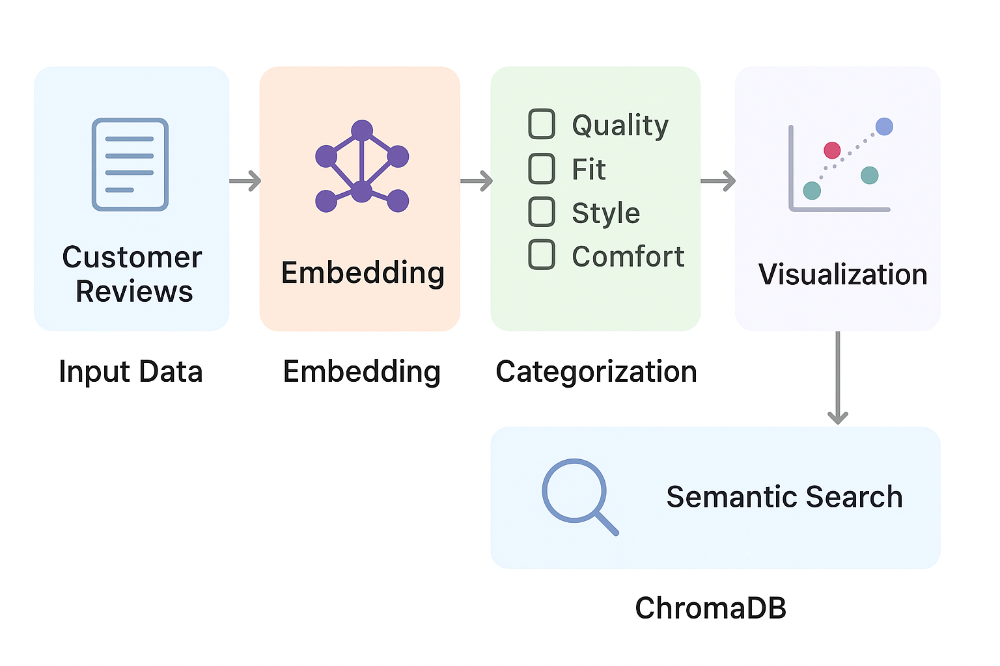
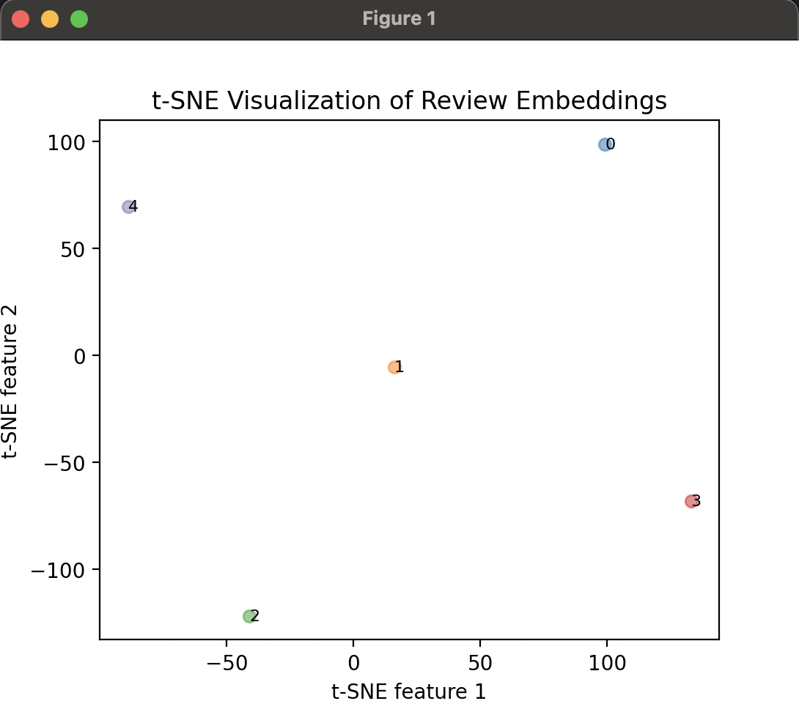

# 🧠 Customer Review Categorization with OpenAI Embeddings

This project demonstrates how to use **OpenAI embeddings**, **t-SNE visualization**, and **ChromaDB** to analyze and categorize customer reviews from an e-commerce dataset.

⚠️ **Note**: This repository contains **architecture, workflow documentation, and demo snippets only**.  
The **full implementation** is kept private and can be shared upon request.

---

## 📌 Project Overview
- Load customer review dataset
- Generate embeddings using OpenAI
- Categorize reviews into themes: `Quality`, `Fit`, `Style`, `Comfort`
- Visualize results with t-SNE
- Store embeddings in **ChromaDB** for semantic search
- Retrieve similar reviews via cosine similarity

---

## 🏗️ Architecture



---

## 📊 Demo Results

Example: t-SNE clustering of review embeddings.



---

## 🔍 Example Code Snippets

```python
# Example: Generate embeddings
from openai import OpenAI
client = OpenAI()

response = client.embeddings.create(
    input=["Love the fabric and fit!", "Too small and uncomfortable"],
    model="text-embedding-3-small"
)

embeddings = [item["embedding"] for item in response.data]
# Example: Categorize feedback
from scipy.spatial import distance
import numpy as np

def categorize_feedback(text_embedding, category_embeddings, categories):
    distances = [distance.cosine(text_embedding, cat_emb) for cat_emb in category_embeddings]
    return categories[np.argmin(distances)]
